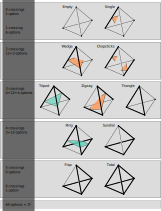

# Marching Tetrahedra

What do we need? An oracle!

``` {.rust #oracle-trait}
pub trait Oracle {
    type Elem;
    fn grid_shape(&self) -> [usize;3];
    fn stencil(&self, x: [usize;3]) -> [Self::Elem;8];
    fn intersect(&self, a: [usize;3], b: [usize;3]) -> Option<Vec3>;
}
```

The oracle provides a grid shape, a way of extracting a voxel (also known as **stenciling**) and a way of finding a intersection given two grid points. We have a separate function that detects if an edge intersects the surface or not and a function to compute that intersection, chiefly because computing the intersection might be an expensive operation. 

If we are looking at an orientable manifold (essentially that means: no edges and a well defined inside/outside), all the information we need is wether a point lies *inside* or *outside*.

> We call this trait `Manifold`, though I'm not sure if it is possible to define something for non-orientable manifolds: to compute the surface of, say a Klein bottle implicitely, is that even possible within this `Oracle` architecture? We would need a stratified array as input, the stencil returning a tuple of floats (one for each stratum), but `intersect` would need to be fed the stratum as an extra argument. In each stratum the surface would no longer be manifold, since there are edges where the surface moves between strata.

``` {.rust #manifold-trait}
pub trait Manifold: Oracle where Self::Elem: Copy {
    fn point_inside(&self, x: Self::Elem, level: Self::Elem) -> bool;
    <<manifold-methods>>
    <<level-set>>
}
```

Each voxel is subdivided into six tetrahedra. There are many ways to do this, but the choice should be such that edges of neighbouring voxels line up. We number the corners of a voxel following a binary indexing scheme: $0 \to (0,0,0)$, $1 \to (0,0,1)$, $2 \to (0,1,0)$ etc. One way to achieve this is first drawing a diagonal and then have all tetrahedra include the diagonal edge. Within this logic, we can define any edge within the voxel as a pair of two integers.

``` {.rust #cube-decomposition}
type VoxelEdge = (usize, usize);

const CUBE_CELLS: [[usize;4];6] =
    [ [ 2, 1, 0, 5 ]
    , [ 2, 0, 4, 5 ]
    , [ 2, 4, 6, 5 ]
    , [ 2, 6, 7, 5 ]
    , [ 2, 7, 3, 5 ]
    , [ 2, 3, 1, 5 ] ];
```

Now for the algorithm, it is subdivided in a collection, combination and computation phase. From architectural point of view, it is not strictly needed to have the `level` as an argument to `level_set`; we could imagine the implementation of `point_inside` taking care of that. We have chosen this interface here to allow for the all to common use case of finding a level set of an `Array3<f64>` dataset. By keeping `level` outside the closure we can implement `Manifold` directly on the `Array3` type.

``` {.rust #level-set}
fn level_set(&self, level: Self::Elem) -> Mesh {
    use std::collections::BTreeMap;
    <<level-set-collect>>
    <<level-set-combine>>
    <<level-set-compute>>
}
```

First we scan each voxel for any intersections. We don't yet compute the actual location of the triangles, just the locations in the grid where there must be a triangle. Each proto-triangle consists of three proto-vertices, where a proto-vertex consists of two neighbouring grid points of which we know one is inside and the other outside. These proto-triangles can be found independently from each other.

``` {.rust #marching-tetrahedra-types}
type Loc = [usize;3];
type ProtoVertex = (Loc, Loc);
```

``` {.rust #level-set-collect}
let mut proto_triangles = Vec::<[ProtoVertex;3]>::new();

for ix in indices(self.grid_shape()) {
    let index = [ix.0, ix.1, ix.2];
    let fx = self.stencil(index);
    self.intersect_voxel(&fx, level).iter().for_each(
        |e| proto_triangles.push(offset_voxel_edge(self.grid_shape(), index, *e)));
}
```

Here, we loop over every location in the grid. We extract a $2 \times 2 \times 2$ stencil, then scan this tiny area for proto-triangles. After we found the triangles within the voxel, we need to convert the voxel-local coordinates to grid coordinates.

``` {.rust #marching-tetrahedra-utils}
fn offset_voxel_edge(shape: [usize;3], ix: [usize;3], et: [VoxelEdge;3]) -> [ProtoVertex;3] {
    let offset = |i: usize| -> [usize;3] {
        [ (ix[0] + ((i & 0x4) >> 2)) % shape[0]
        , (ix[1] + ((i & 0x2) >> 1)) % shape[1]
        , (ix[2] + ((i & 0x1)     )) % shape[2] ]
    };

    et.map(|e| (offset(e.0), offset(e.1)))
}
```

Within the voxel we compute the traditional **marching tetrahedra** algorithm. Each vertex of the tetrahedron is checkout for inside/outside-ness, giving a number between 0 and 15. Depending on this pattern we can identify eight different cases, not looking at orientation of the triangle.

``` {.rust #manifold-methods}
fn intersect_tetrahedron(&self, fx: &[Self::Elem;8], level: Self::Elem,
                         vertices: &[usize;4], triangles: &mut Vec<[VoxelEdge;3]>)
{
    let mut push_triangle = |a1: usize, a2: usize, b1: usize, b2: usize, c1: usize, c2: usize| {
        triangles.push([ (vertices[a1], vertices[a2])
                       , (vertices[b1], vertices[b2])
                       , (vertices[c1], vertices[c2]) ]);
    };

    let mut case: u8 = 0x00;

    if self.point_inside(fx[vertices[0]], level) { case |= 0x01; }
    if self.point_inside(fx[vertices[1]], level) { case |= 0x02; }
    if self.point_inside(fx[vertices[2]], level) { case |= 0x04; }
    if self.point_inside(fx[vertices[3]], level) { case |= 0x08; }

    match case {
        0x00 | 0x0F => {},
        0x01 | 0x0E => { push_triangle(0, 1, 0, 2, 0, 3); },
        0x02 | 0x0D => { push_triangle(1, 0, 1, 2, 1, 3); },
        0x03 | 0x0C => { push_triangle(0, 2, 0, 3, 1, 2);
                         push_triangle(1, 3, 1, 2, 0, 3); },
        0x04 | 0x0B => { push_triangle(2, 1, 2, 0, 2, 3); },
        0x05 | 0x0A => { push_triangle(0, 1, 0, 3, 1, 2);
                         push_triangle(2, 3, 2, 1, 0, 3); },
        0x06 | 0x09 => { push_triangle(1, 0, 1, 3, 2, 0); 
                         push_triangle(2, 3, 2, 0, 1, 3); },
        0x07 | 0x08 => { push_triangle(3, 1, 3, 2, 3, 0); },
        _           => panic!("system error")
    }
}

fn intersect_voxel(&self, fx: &[Self::Elem;8], level: Self::Elem) -> Vec<[VoxelEdge;3]> {
    let mut triangles = Vec::<[VoxelEdge;3]>::new();
    for tet in CUBE_CELLS {
        self.intersect_tetrahedron(fx, level, &tet, &mut triangles);
    }
    triangles
}
```

Now that we have a set of proto-triangles, we need to convert them into proto-vertices and triangles. The nice thing about a proto-vertex is that we have robust equality, something that we wouldn't have had had we computed the actual floating-point coordinates of the vertex. Since we have identity, we can do combinatorics. We loop over every proto-triangle, insert their proto-vertices into a map, such that each vertex is assigned a unique integer. We can then convert every proto-triangle into a triple of integers, each pointing to a different vertex.

``` {.rust #level-set-combine}
let mut proto_vertices = BTreeMap::new();
let mut triangles = Vec::with_capacity(proto_triangles.len());
let mut get_index = |edge: ProtoVertex| -> usize {
    let s = proto_vertices.len();
    if proto_vertices.contains_key(&edge) {
        proto_vertices[&edge]
    } else {
        proto_vertices.insert(edge, s);
        s
    }
};

for [a, b, c] in proto_triangles {
    triangles.push([get_index(a), get_index(b), get_index(c)]);
}
```

What is left is to actually compute the more precise coordinates of every vertex.

``` {.rust #level-set-compute}
let mut vertices = Vec::new();
vertices.resize(proto_vertices.len(), Vec3([0.,0.,0.]));
for ((a, b), i) in proto_vertices.iter() {
    vertices[*i] = self.intersect(*a, *b).unwrap();
}

Mesh {
    triangles: triangles,
    vertices: vertices
}
```

## Implementation of `Oracle` on `Array3`

``` {.rust #array-oracle}
impl<S: Data + RawData<Elem=f64>> Oracle for ArrayBase<S, Ix3> {
    type Elem = f64;

    fn grid_shape(&self) -> [usize;3] {
        let s = self.shape();
        [s[0], s[1], s[2]]
    }
    fn stencil(&self, x: [usize;3]) -> [f64;8] { 
        stencil::flat_2x2x2(&self.view(), x)
    }
    fn intersect(&self, a: [usize;3], b: [usize;3]) -> Option<Vec3> {
        let y_a = self[a];
        let y_b = self[b];
        if y_a * y_b > 0.0 {
            None
        } else {
            let loc = y_a / (y_a - y_b);
            Some(ugrid_pos(a) + grid_pos(make_rel(a, b, self.grid_shape())) * loc)
        }
    }
}
```

``` {.rust #marching-tetrahedra-utils}
#[inline]
fn ugrid_pos(ix: [usize;3]) -> Vec3 {
    Vec3([ix[0] as f64, ix[1] as f64, ix[2] as f64])
}

#[inline]
fn grid_pos(ix: [isize;3]) -> Vec3 {
    Vec3([ix[0] as f64, ix[1] as f64, ix[2] as f64])
}

#[inline]
fn make_rel(a: [usize;3], b: [usize;3], shape: [usize;3]) -> [isize;3] {
    let mut result: [isize;3] = [0;3];
    for i in 0..3 {
        let d = b[i] as isize - a[i] as isize;
        result[i] = if d < -(shape[i] as isize)/2 {
            d + shape[i] as isize
        } else if d > (shape[i] as isize)/2 {
            d - shape[i] as isize
        } else {
            d
        };
    }
    result
}
```

``` {.rust #array-oracle}
impl<S: Data + RawData<Elem=f64>> Manifold for ArrayBase<S, Ix3> {
    fn point_inside(&self, y: f64, level: f64) -> bool {
        y < level
    }
}
```

## Non-manifold surfaces
The classic marching tetrahedra algorithm assumes that the approximated surface is a orientable manifold. This is why it suffices to have an oracle that tells if a given point is inside or outside the set for which we aske the boundary. A more generic case is that of non-manifold surfaces. In that case the surface may have a boundary itself, or in the case of tensor-field topology, we get three $A_3$ surfaces that meet in a $D_4$ line. It is now needed to ask the question: does this given segment intersect the surface?

``` {.rust #non-manifold-trait}
trait NonManifold: Oracle where Self::Elem: Clone {
    fn edge_intersects(&self, a: &Self::Elem, b: &Self::Elem) -> bool;
    <<non-manifold-methods>>
}
```

We could have the case that only one of the edges of a tetrahedron intersects the surface, meaning we would get a surface with a boundary inside that tetrahedron. Depending on the application, these locations may need different treatment.

There are six edges to each tetrahedron, so $2^6 = 64$ possibilities. Only 8 of these cases are to be expected in manifold circumstances.

``` {.rust #non-manifold-methods}
fn intersect_tetrahedron(&self, fx: &[Self::Elem;8],
                         vertices: &[usize;4]) -> EdgeCase<usize> {
    let mut tag: usize = 0;
    let mut bit: usize = 1;

    // 01: 0, 1
    // 02: 0, 2
    // 04: 0, 3
    // 08: 1, 2
    // 0F: 1, 3
    // 10: 2, 3
    for v1 in 0..4 {
        let w1 = vertices[v1];
        for v2 in (v1+1)..4 {
            let w2 = vertices[v2];
            if self.edge_intersects(&fx[w1], &fx[w2]) {
                tag &= bit;
            }
            bit <<= 1;
        }
    }

    match tag {
        0x00 => EdgeCase::Empty,
        0x01 => EdgeCase::Single((0, 1), 2, 3),
        0x02 => EdgeCase::Single((0, 2), 1, 3),
        0x03 => EdgeCase::Wedge((1, 0, 2), 3),
        0x04 => EdgeCase::Single((0, 3), 1, 2),
        0x05 => EdgeCase::Wedge((1, 0, 3), 2),
        0x06 => EdgeCase::Wedge((2, 0, 3), 1),
        0x07 => EdgeCase::Tripod(0, (1, 2, 3)),
        0x08 => EdgeCase::Single((1, 2), 0, 3),
        0x09 => EdgeCase::Wedge((0, 1, 2), 3),
        0x0A => EdgeCase::Wedge((0, 2, 1), 3),
        0x0B => EdgeCase::Triangle((0, 1, 2), 3),
        0x0C => EdgeCase::Chopsticks((0, 3), (1, 2)),
        0x0D => EdgeCase::Zigzag(2, 1, 0, 3),
        0x0E => EdgeCase::Zigzag(1, 2, 0, 3),
        0x0F => EdgeCase::Sundial((1, 3, 2), 0),
        0x10 => EdgeCase::Single((1, 3), 0, 2),
        0x11 => EdgeCase::Wedge((0, 1, 3), 2),
        0x12 => EdgeCase::Chopsticks((0, 2), (1, 3)),
        0x13 => EdgeCase::Zigzag(2, 0, 1, 3),
        0x14 => EdgeCase::Wedge((0, 3, 1), 2),
        0x15 => EdgeCase::Triangle((0, 1, 3), 2),
        0x16 => EdgeCase::Zigzag(1, 3, 0, 2),
        0x17 => EdgeCase::Sundial((1, 2, 3), 0),
        0x18 => EdgeCase::Wedge((2, 1, 3), 0),
        0x19 => EdgeCase::Tripod(1, (0, 2, 3)),
        0x1A => EdgeCase::Zigzag(0, 2, 1, 3),
        0x1B => EdgeCase::Sundial((0, 3, 2), 1),
        0x1C => EdgeCase::Zigzag(0, 3, 1, 2),
        0x1D => EdgeCase::Sundial((0, 2, 3), 1),
        0x1E => EdgeCase::Ring(0, 2, 1, 3),
        0x1F => EdgeCase::Flap((2, 3), 0, 1),
        0x20 => EdgeCase::Single((2, 3), 0, 1),
        0x21 => EdgeCase::Chopsticks((0, 1), (2, 3)),
        0x22 => EdgeCase::Wedge((0, 2, 3), 1),
        0x23 => EdgeCase::Zigzag(1, 0, 2, 3),
        0x24 => EdgeCase::Wedge((0, 3, 2), 1),
        0x25 => EdgeCase::Zigzag(1, 0, 3, 2),
        0x26 => EdgeCase::Triangle((0, 2, 3), 1),
        0x27 => EdgeCase::Sundial((2, 1, 3), 0),
        0x28 => EdgeCase::Wedge((1, 2, 3), 0),
        0x29 => EdgeCase::Zigzag(0, 1, 2, 3),
        0x2A => EdgeCase::Tripod(2, (0, 1, 3)),
        0x2B => EdgeCase::Sundial((0, 3, 1), 2),
        0x2C => EdgeCase::Zigzag(0, 3, 2, 1),
        0x2D => EdgeCase::Ring(0, 1, 2, 3),
        0x2E => EdgeCase::Sundial((0, 1, 3), 2),
        0x2F => EdgeCase::Flap((1, 3), 0, 2),
        0x30 => EdgeCase::Wedge((1, 3, 2), 0),
        0x31 => EdgeCase::Zigzag(0, 1, 3, 2),
        0x32 => EdgeCase::Zigzag(0, 2, 3, 1),
        0x33 => EdgeCase::Ring(0, 1, 3, 2),
        0x34 => EdgeCase::Tripod(3, (0, 1, 2)),
        0x35 => EdgeCase::Sundial((0, 2, 1), 3),
        0x36 => EdgeCase::Sundial((0, 1, 2), 3),
        0x37 => EdgeCase::Flap((1, 2), 0, 3),
        0x38 => EdgeCase::Triangle((1, 2, 3), 0),
        0x39 => EdgeCase::Sundial((2, 0, 3), 1),
        0x3A => EdgeCase::Sundial((1, 0, 3), 2),
        0x3B => EdgeCase::Flap((0, 3), 1, 2),
        0x3C => EdgeCase::Sundial((1, 0, 2), 3),
        0x3D => EdgeCase::Flap((0, 2), 1, 3),
        0x3E => EdgeCase::Flap((0, 1), 2, 3),
        0x3F => EdgeCase::Total,
        _    => panic!("Impossible case")
    }
}
```

``` {.rust #non-manifold-types}
enum EdgeCase<T> {
    Empty,
    <<edge-cases>>
}
```

### Cases

{style="width: 100%; padding: 5pt 15pt 5pt 15pt"}

#### One edge
One edge intersects, we can store this case in a structure $((a, b), c, d)$, should have a routine that makes a triangle running from a point inside triangle $(a, b, c)$, one in $(d, a, b)$ and one on the edge $(a,b)$.

``` {.rust #edge-cases}
Single((T, T), T, T),        // Could be ignored
```

#### Two edges
Either we have two edge with a common vertex, forming a wedge:

This case is similar to a single edge, but now we should make two triangles, the outer edge making a quadrilateral area with the tetrahedron.

We may also have two edges without common vertex. This is a degenerate case.

``` {.rust #edge-cases}
Wedge((T, T, T), T),         // Could be ignored
Chopsticks((T, T), (T, T)),  // Could be ignored
```

#### Three edges

``` {.rust #edge-cases}
Tripod(T, (T, T, T)),        // OK
Zigzag(T, T, T, T),          // Special but possible
Triangle((T, T, T), T),      // Highly problematic
```

#### Four edges

``` {.rust #edge-cases}
Ring(T, T, T, T),            // OK
Sundial((T, T, T), T),       // Tripod + confusion
```

#### Five edges

``` {.rust #edge-cases}
Flap((T, T), T, T),        // Ring + confusion
```

#### Six edges

``` {.rust #edge-cases}
Total
```

### Implementation

``` {.rust #non-manifold-methods}
// Extracts only Tripod and Ring cases, if you use this on a case that actually
// yields a closed manifold, other cases should not appear.
fn free_predicate_set(&self) -> Mesh {
    use std::collections::BTreeMap;
    let mut proto_triangles = Vec::<[ProtoVertex;3]>::new();

    for ix in indices(self.grid_shape()) {
        let index = [ix.0, ix.1, ix.2];
        let fx = self.stencil(index);

        for tet in CUBE_CELLS {
            let mut push = |(a, b), (c, d), (e, f)| {
                proto_triangles.push(offset_voxel_edge(self.grid_shape(), index,
                    [(tet[a], tet[b]), (tet[c], tet[d]), (tet[e], tet[f])]))
            };
            let edge_case = self.intersect_tetrahedron(&fx, &tet);
            match edge_case {
                EdgeCase::Tripod(a, (b, c, d)) => {
                    push((a, b), (a, c), (a, d));
                }
                EdgeCase::Ring(a, b, c, d) => {
                    let ve1 = offset_voxel_edge(self.grid_shape(), index,
                        [(tet[a], tet[b]), (tet[b], tet[c]), (tet[c], tet[d])]);
                    let ve2 = offset_voxel_edge(self.grid_shape(), index,
                        [(tet[c], tet[d]), (tet[d], tet[a]), (tet[a], tet[b])]);
                    proto_triangles.push(ve1);
                    proto_triangles.push(ve2);
                }
                _ => {}
            }
        }
    }

    <<level-set-combine>>
    <<level-set-compute>>
}
```

``` {.rust file=src/marching_tetrahedra/mod.rs}
use crate::numeric::{Vec3};
use crate::stencil;
// use crate::error::{Error};
use crate::mesh::{Mesh};

use ndarray::{Ix3, indices, Data, RawData, ArrayBase};

<<marching-tetrahedra-types>>
<<marching-tetrahedra-utils>>
<<cube-decomposition>>
<<oracle-trait>>
<<manifold-trait>>

<<non-manifold-types>>
<<non-manifold-trait>>

<<array-oracle>>
/*
pub fn bound_level_set<O1: Oracle, O2: Oracle>(f: &O1, y: f64, g: &O2, z: f64) -> Mesh {
    use std::collections::BTreeMap;

    let mut proto_triangles = Vec::<[ProtoVertex;3]>::new(); // <[ProtoVertex;3]>::new();

    for ix in indices(f.grid_shape()) {
        let index = [ix.0, ix.1, ix.2];
        let gx = g.stencil(index);
        if gx.iter().all(|zx| *zx < z) { continue; }

        let fx = f.stencil(index); // stencil::flat_2x2x2(f, index);
        level_set_element(&fx, y).iter().for_each(
            |e| proto_triangles.push(offset_edge_tripple(f.grid_shape(), index, *e)));
    }

    let mut proto_vertices = BTreeMap::new();
    let mut triangles = Vec::with_capacity(proto_triangles.len());
    let mut get_index = |edge: ProtoVertex| -> usize {
        let s = proto_vertices.len();
        if proto_vertices.contains_key(&edge) {
            proto_vertices[&edge]
        } else {
            proto_vertices.insert(edge, s);
            s
        }
        // proto_vertices.try_insert(edge, s).unwrap_or_else(|e| e.value)
    };

    for [a, b, c] in proto_triangles {
        triangles.push([get_index(a), get_index(b), get_index(c)]);
    }

    let mut vertices = Vec::new();
    vertices.resize(proto_vertices.len(), Vec3([0.,0.,0.]));
    for ((a, b), i) in proto_vertices.iter() {
        vertices[*i] = f.intersect(y, *a, *b).unwrap();
    }

    Mesh {
        triangles: triangles,
        vertices: vertices
    }
}
*/

#[cfg(test)]
mod tests {
    use super::*;

    #[test]
    fn test_level_set() {
        use ndarray::arr3;
        let f = arr3(&[[[0., 1., 0.],
                        [1., 2., 1.],
                        [0., 1., 0.]],
                       [[1., 2., 1.],
                        [2., 4., 2.],
                        [1., 2., 1.]],
                       [[0., 1., 0.],
                        [1., 2., 1.],
                        [0., 1., 0.]]]);
        // let m = level_set(&f.view(), 3.0);
        // m.write_obj_file("test.obj");
        // println!("{:?}", m);
    }
}
```

